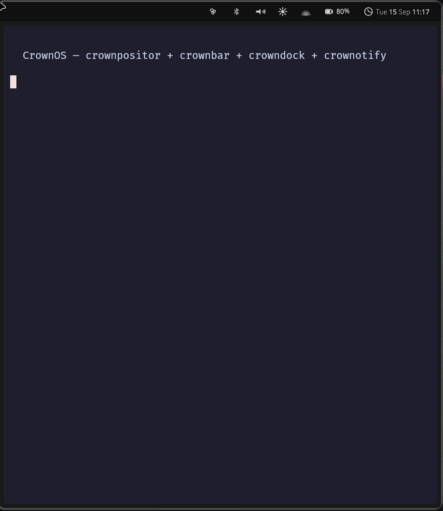

# CrownOS

A Wayland desktop written from scratch in Rust — compositor, shell framework,
bar, dock, notifications, settings schema and a push-to-talk dictation daemon.



*crownpositor with crownbar, running nested inside an existing session. The bar
reserves its exclusive zone; the terminal tiles below it.*

> **CrownOS is early.** It builds, it runs, and it is not something to put on
> your only laptop yet. The
> [project status page](https://github.com/Crown-OS/crownos-documentations/blob/main/docs/00-overview/project-status.md)
> says what works today, component by component.

## Build it

Your distribution's package manager installs the dependencies. There is nothing
distro-specific about CrownOS and no preferred distribution to build it on.

```bash
git clone https://github.com/Crown-OS/crownOs && cd crownOs

# from crownos-setup, which knows the package names for your distro
./bootstrap.sh --check      # what does this machine already have?
./bootstrap.sh --deps-only  # install what it is missing

cargo build --workspace
```

`--check` changes nothing and prints the exact command for your system —
`pacman -S --needed …` on Arch, `apt install …` on Debian, and so on for Fedora,
openSUSE, Alpine, Void and Gentoo.

The package names are not repeated here on purpose. They live in one file,
[`deps.toml`](https://github.com/Crown-OS/crownOs-setup/blob/main/deps.toml),
which generates the bootstrap script, the CI package list and
[the per-distribution tables](https://github.com/Crown-OS/crownOs-setup/blob/main/generated/prerequisites.md).
A copy in this README would be a fifth place to forget to update, and drift
between those copies is a bug this project has already had.

There is no overlay to write, no sibling layout to reproduce and no dependency
to publish first — the crates resolve each other by path.

### Verified, not assumed

The bootstrap path is tested by running it on a bare container of each
distribution — install nothing by hand, let the script do it, then build:

| Distribution | `--deps-only` | `--check` | `cargo build --workspace` |
|---|---|---|---|
| Arch | ok | 21 libraries, 3 tools | 2m 34s |
| Fedora | ok | 21 libraries, 3 tools | 2m 29s |
| Debian | ok | via `Containerfile` | builds |

If a listed distribution fails, that is a bug in `deps.toml`, not something for
you to work around locally.

### Will you and another contributor see the same thing?

Yes, and these are the three reasons — none of which depend on your distribution:

- **One commit.** All nine crates live in this repository, so there is no way to
  have a new `crownshell` against an old `crownbar`. That combination used to be
  possible and it silently broke the compositor for eight days.
- **One toolchain.** `rust-toolchain.toml` pins `1.88.0`; rustup honours it over
  whatever you have installed, so nobody is compiling with a different rustc.
- **One lockfile.** `Cargo.lock` is committed, and CI builds with `--locked`.

What is *not* pinned is your system libraries — Mesa, Wayland, libinput come
from your distribution and will differ. That is deliberate: CrownOS has to work
against what people actually have. `bootstrap.sh --check` tells you what you are
running against.

### If your distribution is not listed

Two fallbacks, neither of which needs your package manager to cooperate:

```bash
nix develop github:Crown-OS/crownOs-setup --command cargo build --workspace
podman build -t crownos-dev -f Containerfile . && podman run --rm -it -v "$PWD:/work:Z" crownos-dev
```

Nix and the container are escape hatches, not the intended path. If the package
manager route fails on a distribution that is listed, that is a bug in
`deps.toml` and worth reporting.

## Try it

Three ways, costing progressively more and testing progressively more. Start at
the top.

### Nested — the daily loop

Runs inside your current session, in a window. Cannot affect your machine.

```bash
./session/install.sh
CROWN_BACKEND=winit crownos-session
```

That is the whole desktop: compositor, bar, dock and notifications. It exercises
layout, rendering, input and IPC — everything except the parts that only exist on
real hardware.

### A spare TTY — the generic way to test the real path

Nesting never touches seat acquisition or DRM/KMS, which are the two things that
decide whether CrownOS works on real hardware. A second TTY tests both, needs no
tooling on any distribution, and the way back is a keystroke.

```bash
./session/install.sh
sudo systemctl start seatd          # or be in a logind session
# Ctrl+Alt+F3 to reach a free TTY, log in, then:
crownos-session
```

`Super+Shift+E` quits. If something wedges, `Ctrl+Alt+F1` returns to the session
you came from — **have that TTY already logged in before you start**, so getting
back is not itself a thing that has to work.

This is what most compositor development actually looks like. Use it before a VM.

### A VM — if you want isolation first

```bash
./contrib/run-vm.sh
```

Boots a guest on virtio-gpu and autologins into CrownOS, with your `target/`
mounted read-only so a rebuild on the host is picked up by the next boot.

**This one needs Nix**, because the guest is built as a NixOS image — it is the
one part of CrownOS that is not distribution-neutral, and it is an optional
convenience rather than a required step. If you do not have Nix, use the TTY
above; it tests the same code paths.

### Real hardware

```bash
sudo ./session/install.sh --system
```

Then pick CrownOS at your display manager. Have a second TTY available the first
time, and read
[the compositor's notes](crates/crownpositor/README.md) on seats first.

## The crates

| Crate | What it is |
|---|---|
| `crownpositor` | Tiling Wayland compositor, built on Smithay. It *is* the session — it owns the socket and spawns everything else. |
| `crownshell` | The layer-shell + Vello framework every surface is built on |
| `crownos-config` | Shared settings schema, live-reloading, RON on disk |
| `crownbar` `crowndock` `crownotify` | Bar, dock, notification daemon |
| `crowndictator` | Push-to-talk voice dictation |
| `crownuikit` | Widget kit on xilem, for the settings panel |
| `crownpositor-config` | The compositor's compiled configuration types |

They are one Cargo workspace but publish to crates.io as independent crates with
independent versions — `cargo add crownshell` works exactly as before.

## Configuration

`~/.config/crownos/*.ron`, watched live. A rebind takes effect without a restart.
`session/compositor.example.ron` is a working starting point;
[the schema reference](https://github.com/Crown-OS/crownos-documentations/blob/main/docs/50-reference/config-schema.md)
documents every field.

One thing worth knowing up front: a keybind that does not parse silently reverts
its whole section to defaults, with no error. Key names are labels — `A`, `Left`,
`Space`, `F5` — not the W3C `code` spellings (`KeyA`, `ArrowLeft`).

## Contributing

```bash
cargo build --workspace --all-targets
cargo test --workspace --exclude crownotify
dbus-run-session -- cargo test -p crownotify -- --test-threads=1
cargo fmt --all
```

rustfmt blocks in CI; clippy is advisory while a lint backlog is cleared. The
toolchain is pinned to 1.88.0 in `rust-toolchain.toml` — rustup honours that over
whatever you have installed, so everyone compiles with the same rustc.

The [contribution guide](https://github.com/Crown-OS/crownos-documentations/blob/main/CONTRIBUTING.md)
has the rest.

## Elsewhere in the organisation

[crownos-documentations](https://github.com/Crown-OS/crownos-documentations) ·
[crownOs-setup](https://github.com/Crown-OS/crownOs-setup) ·
[crownos-iso](https://github.com/Crown-OS/crownos-iso) ·
[crownos-website](https://github.com/Crown-OS/crownos-website) ·
[crowncrate-linux](https://github.com/Crown-OS/crowncrate-linux) ·
[crowncrate-android](https://github.com/Crown-OS/crowncrate-android) ·
[lls-protocol](https://github.com/Crown-OS/lls-protocol)

## Licence

MIT — see [LICENSE](LICENSE). `crownuikit` bundles the Inter typeface, which is
SIL OFL 1.1; its licence travels with it at
`crates/crownuikit/resources/fonts/LICENSE-Inter.txt`.
